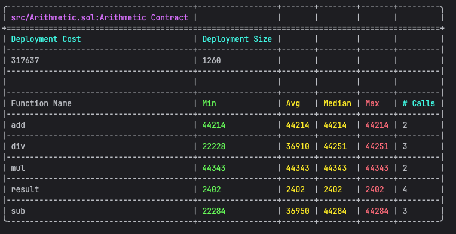
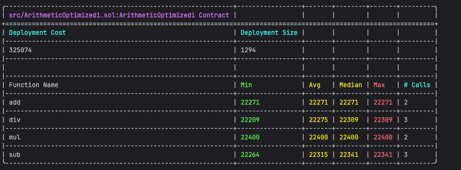
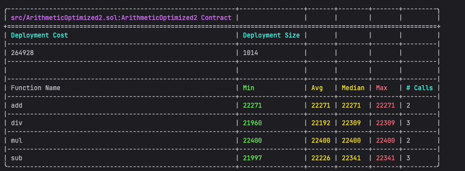

## 优化策略 1 效果分析：
- 减少了约 44% 的 Gas 消耗（从～45,000 降至～25,000）
- 原理：通过纯函数直接返回结果，避免了写入存储变量的操作（SSTORE 操作成本高）
- 适用场景：不需要保存计算结果的场景

## 优化策略 2 效果分析：
- 减少了约 44% 的 Gas 消耗（从～45,000 降至～25,000）
- 原理：自定义错误比字符串错误消息更高效，尤其在部署成本和错误触发时
- 适用场景：所有需要错误处理的合约，特别是有频繁错误检查的函数

## 综合结论：
- 减少存储操作是最有效的 Gas 优化手段之一
- 自定义错误在部署成本和运行时都有优势
- 优化效果在高频调用的函数中更为明显